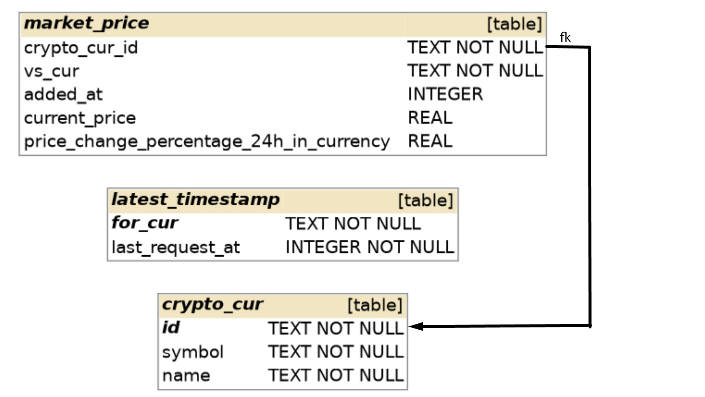

## Crypto currency ETL

The repository contains simple script which implements the following scenario:
1. Download from CoinGecko free of charge service:
    b. List of supported coins and
    a. Market data of all coins with British Pound as a target currency.
2. Load the data in SQLite tables using Python and generate reports to:
    a. List all coins not traded in British Pounds
    b. Show the coins whose market capitalization changed by more than 5% in the last twenty four hours. The change could be positive or negative.

### To run the script:

1. Create virtual environment with `python 3.10` (or higher):  
    windows: `python -m venv venv`  
    *nix: `python3.10 -m venv venv`
2. Activate it:  
   windows: `venv\Scripts\activate`  
   *nix:  `source venv/bin/activate`
3. Install requirements:
    `pip install -r requirements.txt`
4. Run script:
   `python crypto_etl.py`

### Notes:

The script functionality and DB contain only parameters and columns/tables needed for the task solution. Only free API is used and supported.

The DB relationship diagram looks as shown on the picture:   

Fields `vs_cur` and `added_at` in `market_price` table allow to request and save data for different currencies (not only 'gbp') multiple times. Thought tere was no need to create a separate table for `vs_cur` for this scenario, so just one value ('gbp') of `vs_cur` is used.
By default, reports are generated for the most recent data for a given currency and saved to folder `./reports/{insertion_datetime}/{report_name}`. The table `latest_timestamp` stores timestamp of the freshest market data for a given currency in `for_cur` column (just one 'gbp' value in our case). 

### Futhure improvements

Due to time limit the following was not done:
*  Add tests
*  Use sessions to make API calls and manage API timeouts via HTTPAdapter
*  Write to DB asynchroniously OR
*  Save already obtained data while requesting and restore if untreated error happens 
*  Support different types of reports
*  Add types annotation
*  Add parameters validation, error treatment
*  Refactor parameters order, restructure the script
*  Add support for paid API

